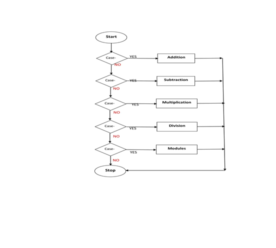
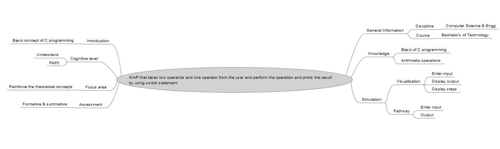

## Storyboard (Round 2)

Experiment : Name of the Experiment:WAP that takes two operands and one operator from the user and perform the operation and prints the result by using switch statement.

### 1. Story Outline:

In this experiment, we can perform any one mathematical operation from addition, subtraction, multiplication, division & modulo. We perform these operations using the concepts of switch statement. The objective of this experiment is that a we can understand and describe the basic concept of mathematical operation using switch statement.

### 2. Story:

In this experiment, we are calculate the addition, subtraction, multiplication, division & modulo of any two numbers using switch statement. In this experiment, we take the two value as an input , after takes input value select any one operation from the drop down and calculate the  final result as per selection of operation. With the help of this experiment we can understand and describe the basic concept of mathematical operation using switch statement.. 

#### 2.1 Set the Visual Stage Description:
On the simulator screen, we can read the entire instruction carefully. After this we can input two numeric values through two text boxes, these numeric values will be either integers or float. After input the values we can select any one operation i.e. Addition (+), Subtraction (-), Multiplication (*), Division (/) & modulo (%) from drop down button and press the Calculate button. After pressing Calculate button the final result will be displayed in the text box of value section. We can reset all the values after pressing another button Reset.  

#### 2.2 Set User Objectives & Goals:
(i) To give users a feel for the real world system and how to use theoretical knowledge on practical system.. 
(ii) User will be able to describe the concepts of different mathematical operations. 
(iii) User will be able to determine addition, subtraction, multiplication, division & modulo of any two numbers. 

#### 2.3 Set the Pathway Activities:

Users will follow the following steps: 
(i) User will click on the simulator and simulator screen will be open for performing the experiment.  
(ii) There are two text boxes for the input (Operands) values. User will give input for performing mathematical operation. 
(iii) Now, User can select any one operation from dropdown list. 
(iv) There is button on screen namely Calculate, by pressing it user can get their result in another text box of Value section. 
(v) There are separately four text boxes in which first & third text boxes stores operands value, second text box stores operator and fourth text box stores final result.   
(vi) There is another button namely Reset, by which user can clear all the values of text boxes. <br.

##### 2.4 Set Challenges and Questions/Complexity/Variations in Questions:

Students will be asked question based on various cognitive levels. The questions are as follows: 
Difficulty Level: Understand 
1. 1.	In Switch statement the value of expression has defined in: 
a.	Integer  
b.	Float  
c.	Character  
d.	Integer & Character<b>  

Difficulty Level: Apply 
2.	The output of the following program wiil be: 
int main() 
   { 
     int num=1; 
     switch(num+2) 
     { 
         case 1: 
           printf("Case1”); 
         case 2: 
           printf("Case2"); 
         case 3: 
           printf("Case3"); 
         default: 
          printf("Default"); 
    } 
    return 0; 
  } 

a.	Case 3 
b.	Case3 Default<b> 
c.	Case 1 Case 2 Case 3 
d.	Return 0 

(i) User will click on the simulator and simulator screen will be open for performing the experiment.  
(ii) There are two text boxes for the input (Operands) values. User will give input for performing mathematical operation. 
(iii) Now, User can select any one operation from dropdown list. 
(iv ) What will happen if we are not using  getch() function? 
(v) Why C programming called procedural programming language?

##### 2.5 Allow pitfalls:
(i) If the user gives the character instead of integers as an input then the simulator won't perform any operation and will ignore the given input. 

##### 2.6 Conclusion:
(i) User will take hardly 5 minutes to understand the procedures. 
(ii) It will take max. 10 minutes to complete the experiment. 
(iii) User will get a basic idea and procedure to make a program.

##### 2.7 Equations/formulas: NA
•	 Switch Statement:

switch (expression) 
{ 
   case constant1: 
      // statements 
      break;

   case constant2: 
      // statements 
      break;

   case constant3: 
      // statements 
      break;

   case constant4: 
      // statements 
      break;

   case constant5: 
      // statements 
      break;

   default: 
      // default statements 
}
 

### 3. Flowchart 4
 
Flow chart for the experiment implementation for that takes two operand and one operator from the user and perform the operation and print the result by using switch statement.

### 4. Mindmap:
 
Link to mindmap here : Store the mindmap in both .mm & .png extension in the /mindmap folder and include link of only .pdf verison here   (guide : An elaborate mind map (connecting all the points in the experiment flow ) should be prepared and submitted by the lab proposer. The mind map should be a clear and detailed document that takes into account all minute intricacies involved in the development of virtual lab. The mindmap should be self-content and any developer across the globe should be able to code it with all those details. using only FreeMind   http://freemind.sourceforge.net/wiki/index.php/Main_Page  (send the .png file and also the original .mm extension project file. )
 

### 5. Storyboard :
Storyboard: <a href="storyboard/ezgif.com-gif-maker.gif
"> [here]</a>
Link to storybaord (.gif file ) here :

